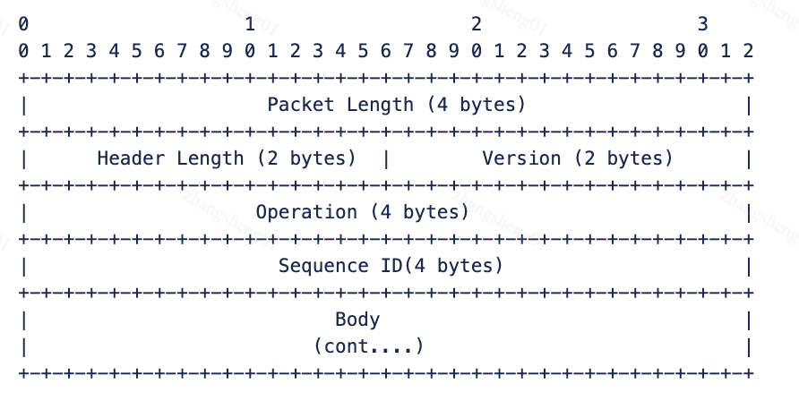
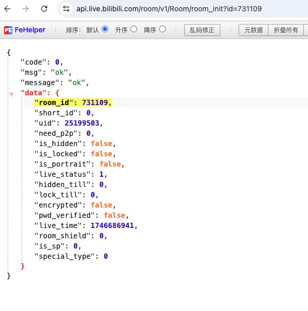
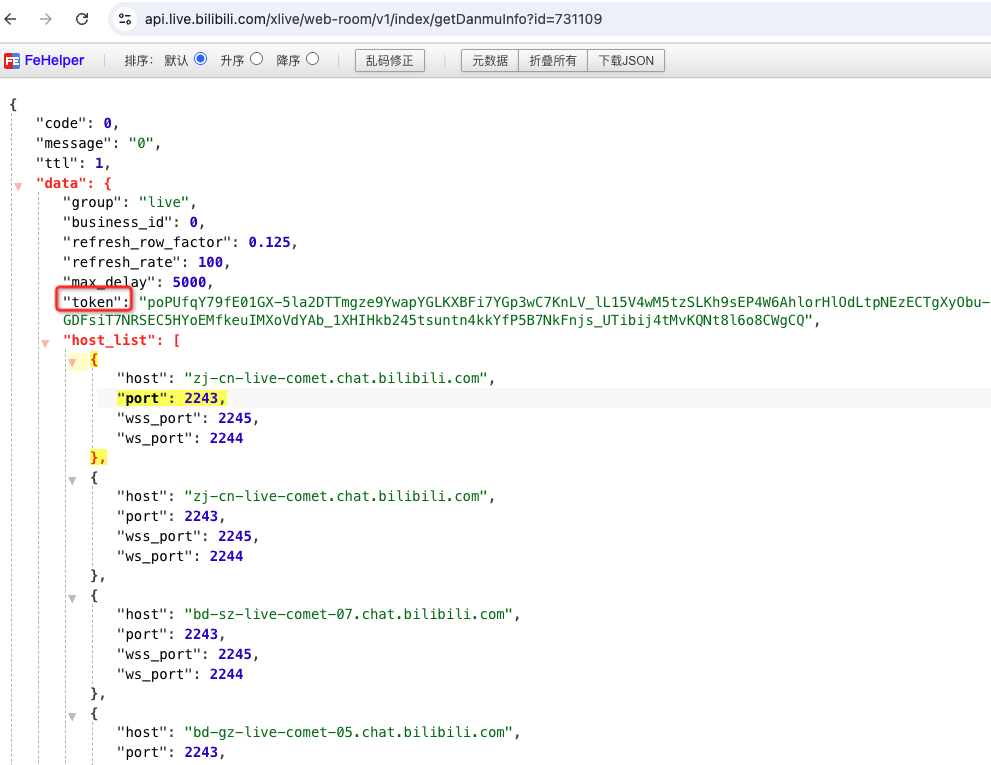
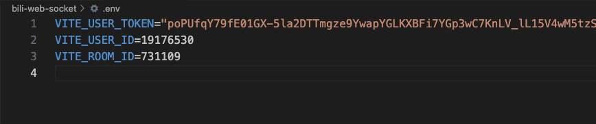
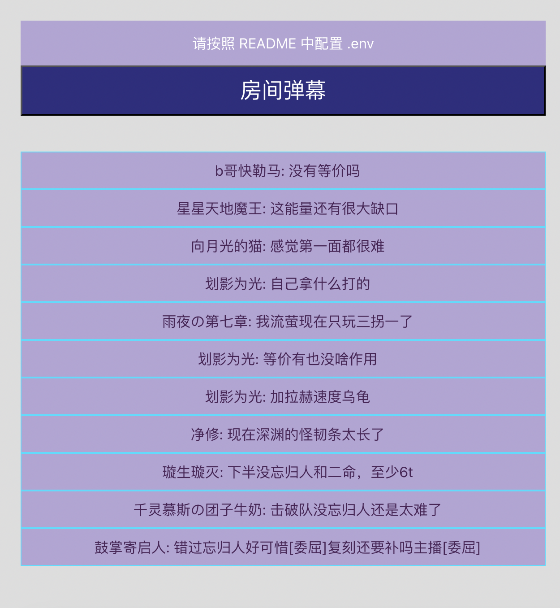

# bili-web-socket

## 简介
原始项目已经无法执行，原因是 B 站定期进行了协议升级，导致之前的代码无法正常工作。
本项目是对原始项目的修改，旨在解决 B 站协议升级导致的问题。

## 协议文档地址

https://open-live.bilibili.com/document/657d8e34-f926-a133-16c0-300c1afc6e6b#h1-u957Fu94FEu6570u636Eu534Fu8BAEu8BF4u660E

https://open.bilibili.com/doc/4/5cac94fe-57f9-06db-7515-523d81c44f85#h2-2-




## 使用说明

### 获取直播间 room ID
https://api.live.bilibili.com/room/v1/Room/room_init?id=1985029627  (需要网页登录)


### 获取 token
https://api.live.bilibili.com/xlive/web-room/v1/index/getDanmuInfo?id=1985029627 (需要网页登录)




## 运行

```bash
npm run dev
### 1985029627 可以替代为任意直播间 room ID
```
### 配置
获取 token, 自己的 uid 和 主播 roomid， 配置到 .env 中即可



## 效果
