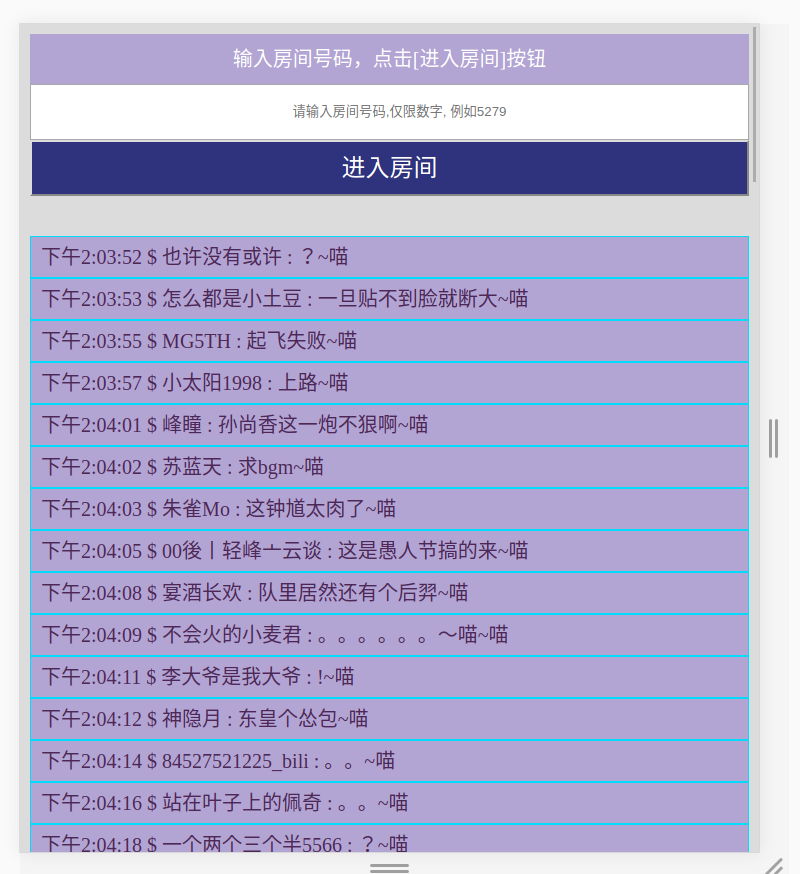

### 目前只是web通过websocket链接

##### 请打开控制台，接受弹幕  目前用原生的ws实现，建议使用chrome浏览器

[demo地址](https://leeeeeem.github.io/bilibili-web-socket/example/)

#### 特别提醒，尽量进一个比较火的直播房间 (⊙﹏⊙)b 有的很冷清半天看不到一个弹幕

[B站直播网址](https://live.bilibili.com/)

>  这个房间稳定有弹幕 7623885

> 最新更新 => 通过进行nginx代理，通过我的域名转发到bilibili弹幕ws服务上，目前服务到期不再转发，开发者自行配置

> 导入 npm install -d bilibili-websocket 或者 全局引用 BILIWS  window.BILIWS

> BILIWS 对外暴露$destroy、$start、$subscribe三个API。

> 使用方式见example示例